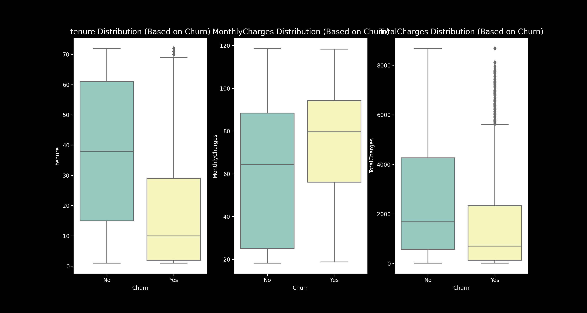
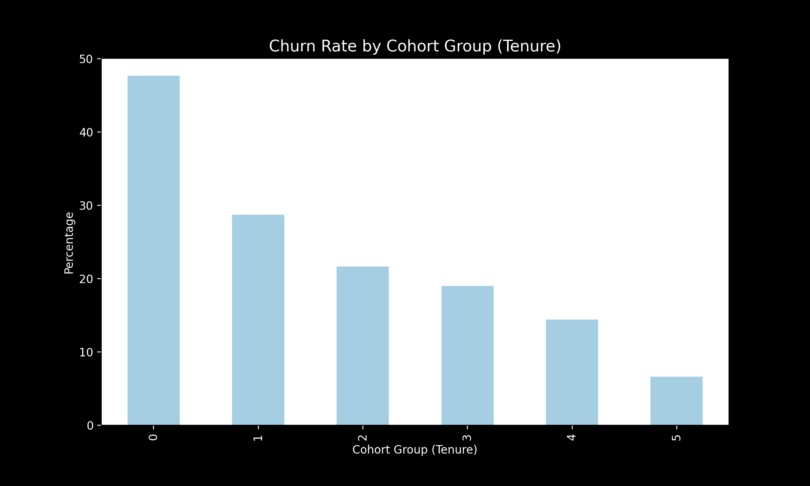

# Supervised Learning for Customer Churn Prediction

## Project Overview
This project aims to analyse and predict customer churn in a telecommunications company using supervised learning techniques. It incorporates exploratory data analysis (EDA), cohort analysis, and tree-based machine learning models, with a focus on Gradient Boosting Classifier. to analyze and predict customer churn in a telecommunications company using exploratory data analysis (EDA), cohort analysis, and Gradient Boosting Classifier.

## Dataset
The dataset used in this project is similar to the **Kaggle Telco Customer Churn dataset** ([link](https://www.kaggle.com/datasets/blastchar/telco-customer-churn/data)), but may contain slight differences. It includes customer details, service subscriptions, and churn status.

## Objectives
1. **Perform Exploratory Data Analysis (EDA)** to understand key factors influencing churn.
2. **Conduct Cohort Analysis** to examine churn behavior based on customer tenure.
3. **Train and evaluate multiple machine learning models** to determine the best model for churn prediction.
4. **Visualize important insights** including feature importance and model performance.

## Exploratory Data Analysis (EDA)
### 1. Churn Distribution
Churn distribution analysis indicates that approximately 25% of customers have churned, meaning they have discontinued the service. Understanding this proportion is crucial for identifying churn drivers and implementing retention strategies.
Shows the proportion of customers who have churned versus those who have not.

### 2. Feature Distribution Based on Churn
- **Tenure (Length of Stay):** Customers who churn tend to have shorter tenures, indicating that newer customers are more likely to leave.
- **Monthly Charges:** Churned customers generally have higher monthly charges, suggesting that cost might be a significant factor in churn.
- **Total Charges:** Customers who have churned tend to have lower total charges overall, reinforcing the idea that early-stage customers are more prone to leaving.
Boxplots visualizing the distribution of key numerical features for churned and non-churned customers.

### 3. Feature Correlation to Churn
This visualisation shows the correlation between different features and churn. Higher correlation values suggest a stronger relationship between the feature and churn, helping to identify key variables influencing customer retention.
Displays the correlation between various features and churn, helping identify the most impactful variables.

### 4. Cohort Analysis (Churn Rate by Tenure)
- The churn rate is highest within the first year (0-1 year), suggesting that new customers are the most likely to leave.
- Customers who stay longer than three years exhibit significantly lower churn rates.
- These findings highlight the importance of customer engagement and retention strategies within the first year of service.
This bar chart shows how churn rate varies across different customer tenure groups.

## Model Training & Performance
We trained multiple models and compared their performance to select the best one.

- **Models Used:**
  - Decision Tree Classifier
  - Random Forest Classifier
  - Gradient Boosting Classifier

- **Best Model:** **Gradient Boosting Classifier**
  - **Accuracy:** 78.89%
  - Gradient Boosting was chosen as it outperformed other models in accuracy and feature selection.

### Model Performance Comparison
This bar chart compares the accuracy of different models used in the analysis. Gradient Boosting outperformed Decision Tree and Random Forest, achieving the highest accuracy.
This bar chart compares the accuracy of different models.
